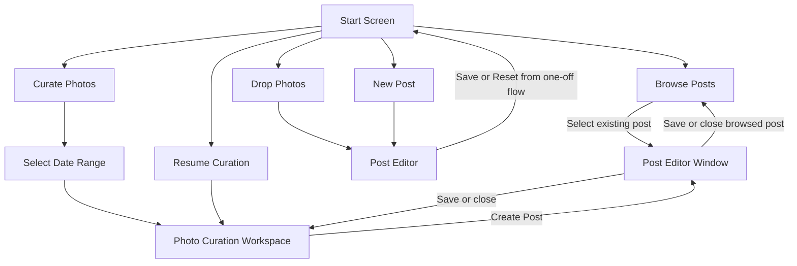
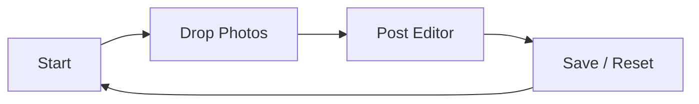
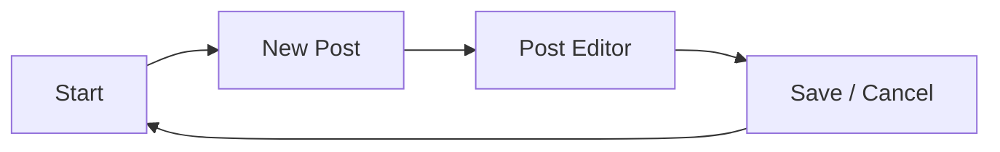
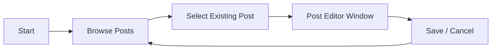
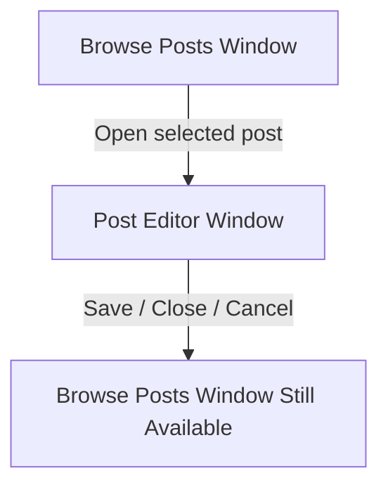
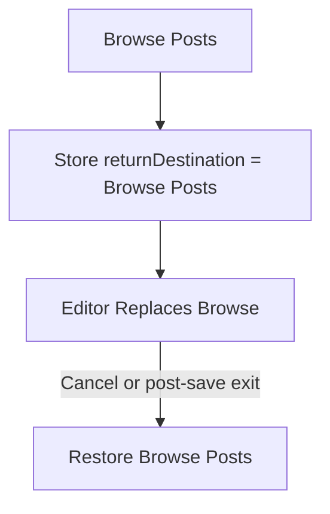
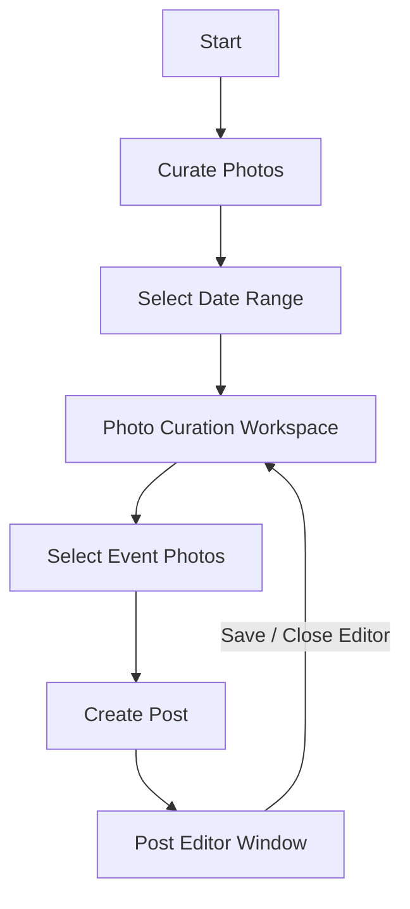
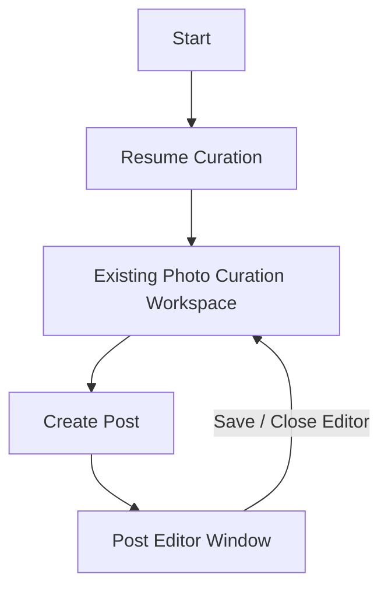
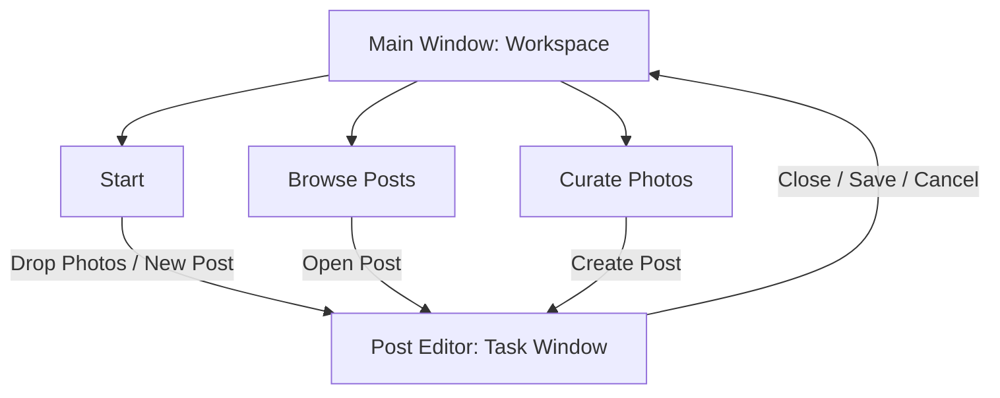
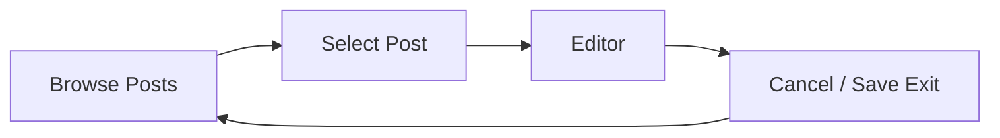

# Photolog UX Paths

This document describes the intended user paths from the main window into each major workflow: drag photos, New Post, Browse Posts, and Curate Photos.

## Navigation Principle

Photolog should preserve the user's workflow context.

When a user enters the editor from a workspace, closing, canceling, or saving should return them to that workspace rather than always returning to the starting screen.

The main workspaces are:

- **Start** — the welcome screen and global entry point
- **Browse Posts** — the existing-post library
- **Curate Photos** — the photo-event curation workspace
- **Post Editor** — the writing and save/preview surface

## Overall Path Map

## Start Screen

The Start screen is the hub for beginning work.

Available paths:

- Drag photos into the app
- Create a New Post
- Browse Posts
- Curate Photos
- Resume Curation, when a curation session already exists

The Start screen should not be treated as the universal return destination. It is only the correct return destination when the user began from Start without entering another workspace.

## Drag Photos Path

### Current Intent

Drag-and-drop is a fast one-off creation flow.

### Expected Path

### Expected Behavior

- Dropping photos creates a new draft immediately.
- The editor may replace the Start screen because there is no prior workspace to preserve.
- **Reset** discards the draft and staged files, then returns to Start.
- **Save** writes the post and images to the configured Hugo repo.
- **Preview** saves locally without git automation, starts Hugo if needed, and opens the current saved post.

## New Post Path

### Current Intent

New Post is a blank one-off creation flow.

### Expected Path

### Expected Behavior

- New Post opens an empty editor draft.
- **Cancel** returns to Start.
- **Save** writes the post to the configured Hugo repo.
- This path does not need to return to Browse Posts or Curate Photos because it did not begin from those workspaces.

## Browse Posts Path

### Previous Problem

Browse Posts currently behaves like a temporary state. After selecting a post, the app leaves Browse Posts and opens the editor in the main window. When the user cancels or finishes editing, the app returns to Start instead of Browse Posts.

This is confusing because the user was browsing a collection and expects to return to that collection after editing one item.

### Implemented Behavior

Browse Posts now remains open. Selecting a post creates an independent editor draft and opens it in a separate Post Editor window.

### Expected Path

### Expected Behavior

- Browse Posts should remain the user's active workspace.
- Selecting a post opens an editor window for that post.
- **Cancel** should discard unsaved changes and return to Browse Posts.
- **Save** should save changes and either:
  - stay in the editor with saved status, or
  - return to Browse Posts with the list refreshed.
- Returning to Browse Posts should preserve list position and ideally the selected row.
- Button labels should reflect context, such as **Back to Browse** or **Cancel Editing**, rather than only generic **Cancel**.

### Recommended Implementation Direction

Implemented:

Acceptable minimum:

## Curate Photos Path

### Current Intent

Curate Photos is a repeated creation workflow. The user usually selects different groups of photos and creates multiple posts.

### Expected Path

### Expected Behavior

- The curation workspace should remain open while posts are created.
- Creating a post should not replace or destroy the curation view.
- The user should be able to create multiple posts from different events without reloading the same date range.
- The selected event, scroll position, date range, and photo selections should remain stable after opening an editor.
- **Change Date Range** should explicitly warn that it will rescan and reset current curation selections.

### Suggested Labeling

- Use **Create Post** instead of **Export**.
- Avoid showing raw markdown as the primary step unless it is explicitly an advanced action.
- If a markdown sheet remains, its primary action should be **Create Post**, not **Open Post Editor**.

## Resume Curation Path

### Expected Path

### Expected Behavior

- Resume Curation should restore the previous curation state.
- It should not ask for the date range again unless the user chooses **Change Date Range**.
- If a curation session exists, Resume Curation should be visually prominent enough that the user understands work is already in progress.

## Post Editor Behavior By Source

The Post Editor should know where it came from.

| Source | Editor Type | Cancel / Reset Destination | Save Destination |
| --- | --- | --- | --- |
| Drag Photos | Main-window editor or separate editor | Start | Stay in editor or Start |
| New Post | Main-window editor or separate editor | Start | Stay in editor or Start |
| Browse Posts | Prefer separate editor window | Browse Posts | Stay in editor or Browse Posts |
| Curate Photos | Separate editor window | Curate Photos remains open | Curate Photos remains open |
| Resume Curation | Separate editor window | Curate Photos remains open | Curate Photos remains open |

## Recommended Unified Model

The cleanest long-term model is:

Under this model:

- Start remains available.
- Browse Posts remains available while editing selected posts.
- Curate Photos remains available while creating multiple posts.
- Drag Photos and New Post can also open editor windows, making all post creation consistent.

This avoids hidden state transitions and makes repeated workflows predictable.

## Minimum UX Fix

If the app keeps the current single-window editor for now, the first fix should be:

This addresses the most confusing path because Browse Posts is clearly a workspace, not a one-off action.
